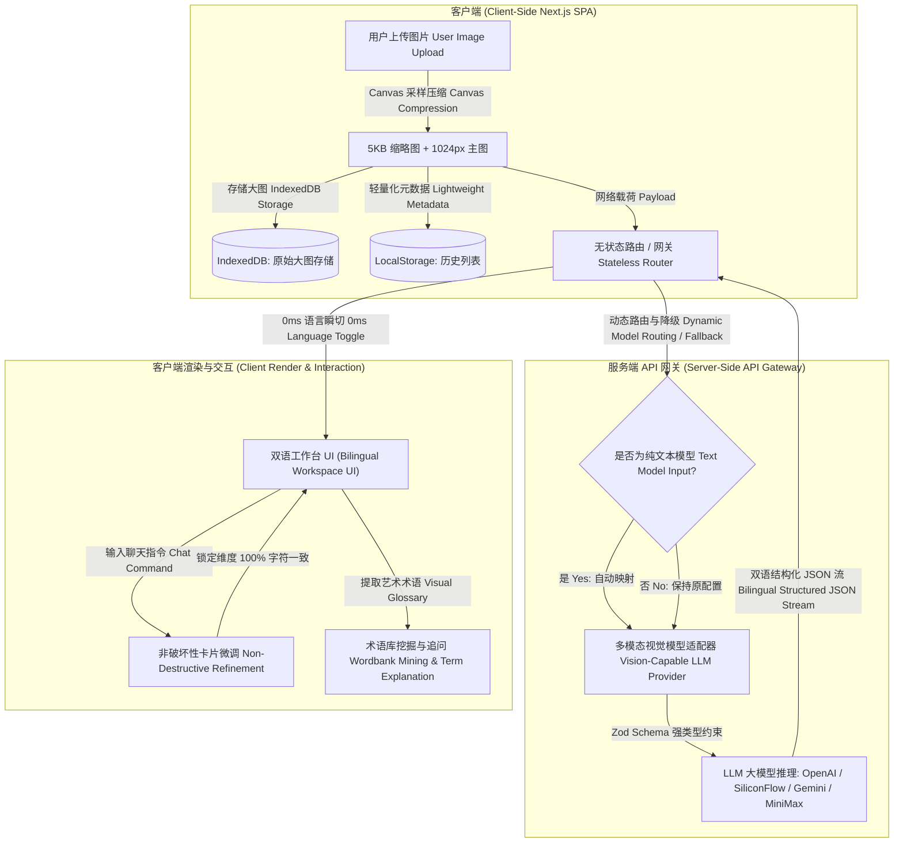

# 🎨 Prompix - Visual Prompt Intelligence Workspace
### 极具诗意与自然呼吸感的多模态 AI 提示词反推与精炼创作工作台

[English Version](./README_EN.md) 

</div>

---

## 💡 产品定位与痛点分析 (Product Positioning & Pain Points)

在以 Midjourney、Stable Diffusion 和 DALL-E 为核心的 AI 视觉创作时代，创作者面临的痛点已不再是**“如何生成一张图”**，而是**“如何精准控制与沉淀自己的视觉语言体系”**。

当前市面上的提示词反推工具（如 CLIP、简单的 LLM 问答）普遍存在以下三大痛点：
1. **单点式工具，无资产沉淀**：简单的“图片上传 -> 文本生成”无法保存历史记录，创作者无法将灵感沉淀为结构化资产。
2. **高昂的推理成本与延迟**：为了在不同语种（如中/英）中切换对比，需要重新调用昂贵的多模态大模型进行二次分析。
3. **微调时的破坏性重写**：当用户只想调整“光影”时，传统大模型会连同“主体”、“构图”一起大范围重构，破坏了创作者的局部微调意图。

**Prompix** 的产品定位是 **一个专为 AI 创作者设计、保护隐私且注重沉淀的“视觉提示词智能工作台” (Visual Prompt Intelligence Workspace)**。它通过创新的“非破坏性维度锁定”、“双语直出”和“本地资产隔离存储”等策略，完美解决了上述痛点。

---

## 🗺️ 系统技术架构 (System Architecture)

Prompix 采用了**轻量级无状态服务端网关 + 客户端大容量存储隔离**的先进架构，确保了极佳的用户隐私保护和极高的响应速度：




---

## ✨ 核心亮点与产品经理决策思维 (Core Highlights & PM Design Rationale)

在 Prompix 的开发过程中，我们始终遵循**“体验驱动、成本敏感、工程严谨”**的 AI 产品设计哲学。以下是项目的核心亮点，以及我们做出相关技术方案决策背后的**产品思维 (Product Rationale)**。

### 🌾 1. 莫兰迪自然呼吸感设计 (Poetic Morandi Theme & Smooth Physics)
*   **设计细节**：温润燕麦色（`#FBF9F6`）与 Obsidian 暗夜黑双色主题。界面融合了极轻的 CSS SVG 实体纸张颗粒噪点质感，并基于 Framer Motion 微动效（物理阻尼参数 `stiffness: 100, damping: 20`）构建，彻底摆脱了传统“冷冰冰的 AI 工具感”。
*   **💡 产品决策思维 (PM Rationale)**：
    *   **为什么不采用高饱和度的“科技感蓝紫渐变”？** 因为创作者在工作台前需要极度专注，高饱和度会造成视觉疲劳。而柔和的莫兰迪配色与模拟纸张的颗粒感，能营造出一种“实体画册”的物理触感与安静的创作环境。
    *   **页面高度控制决策**：坚持 `100vh` Viewport 零滚动设计，所有面板在一屏内收纳。频繁的垂直滚动会打断创作者在“微调 - 复制 - 对比”这一闭环流程中的心流体验。

### 0️⃣ 2. 0ms 语种瞬切设计 (Scheme A - Dual Language Output)
*   **技术实现**：多模态首轮分析时，通过特定的 System Prompt 强制模型以结构化 JSON 同时返回英文提示词卡片（`original`）与中文对照（`translated`）。
*   **💡 产品决策思维 (PM Rationale)**：
    *   **为什么不用传统的前端一键“翻译按钮”（每次点击都调用大模型翻译 API）？**
        1.  **高昂的二次费用**：翻译接口每次调用都需产生 Token 开销。
        2.  **网络延迟打断流**：用户每次切换语言都要等待 2~3 秒，无法做到“0ms 瞬时直观对比”。
        3.  **大模型幻觉**：重复调用翻译接口可能会导致返回的格式发生变异。通过“首次双语直出”，用户可以在前端实现 **0ms 切换**，在零延迟体验的同时，**为用户省去 90% 以上的多模态推理费用**。

### 🤖 3. 智能多模态降级与 Fallback 路由引擎 (Intelligent Model Fallback Engine)
*   **技术实现**：在服务端 `OpenAIServerProvider` 与客户端的 `openai.ts` / `siliconflow.ts` 适配器中构建了智能路由映射。当检测到当前任务需要图片多模态输入，但用户配置的是不支持 Vision 的纯文本模型（例如 `deepseek-ai/DeepSeek-V3`、`o1-mini`、`gpt-3.5-turbo`）时，系统会在请求发送前，自动将其映射至对应的多模态模型（如 `Qwen/Qwen2.5-VL-72B-Instruct` 或 `gpt-4o-mini`），而对于后续的纯文本操作（如术语追问、翻译）则原样保留纯文本模型以保障高推理能力。
*   **💡 产品决策思维 (PM Rationale)**：
    *   **为什么不直接在前端报错拦截，让用户自己去改设置？**
        用户并非技术专家，强行抛出 `No endpoints found that support image input` 等技术黑话会引发严重的焦虑与流失率。
        产品应当具备 **“渐进式自适应 (Progressive Resilience)”** 的容错能力，在系统底层通过策略引擎为用户做降级备选，从而将产品的**“不可用状态”降低为零**。

### 🔒 4. 非破坏性维度卡片微调 (Non-Destructive Chat Card Locking)
*   **技术实现**：Prompix 将提示词反推拆解为 6 个核心维度（Subject, Environment, Composition, Lighting, Mood, Style）。在多轮对话微调时（例如输入“把天改成黑夜”），服务端将执行**非破坏性修改规约**：模型仅被授权微调相关维度（如 Lighting 与 Environment），其余未涉及卡片（如 Subject、Style）的提示词**绝对保持 100% 字符一致**。
*   **💡 产品决策思维 (PM Rationale)**：
    *   在传统的通用聊天机器人中，微调会导致整个提示词被大范围重写。对于 AI 创作者来说，好不容易通过随机种子锁定的构图和风格会随着一次微调瞬间崩溃。
    *   **维度级“锁存 (Locking)”** 是我们对“AI 随机性”与“人类确定性”的一种平衡解法。通过锁定未被改动的原子卡片，保留了创作资产的稳定性。

### 📦 5. 存储分层与大图解耦策略 (Dual-Layer Decoupled Storage Architecture)
*   **技术实现**：
    1.  **LocalStorage**（5MB 限制）：仅存放非常小且高频的文本 Metadata 历史索引列表。
    2.  **IndexedDB**（通过 `idb-keyval`）：以 `prompixImage_{id}` 为物理键，解耦存储大分辨率的 Base64 原始图片。
    3.  **Canvas 缩略图管道**：上传时，前端 Canvas 自动对大图进行等比例缩采样（120px，quality 0.5）生成 5KB 左右缩略图存放在 Metadata 中，供 Library 列表秒级秒开渲染。
*   **💡 产品决策思维 (PM Rationale)**：
    *   **为什么不在一开始就图文合一全部塞进本地？** 
        普通的 Base64 图片一张就高达 1~2MB。如果图文合一存放在 LocalStorage，用户上传 3 张图就会发生浏览器崩溃；即使放 IndexedDB，如果列表渲染时一次性从数据库中反序列化数十兆的图片数据，整个前端也会发生不可接受的顿卡。
        **“数据分层、按需提取”**是支持“纯本地运行、隐私安全第一”产品的核心工程规范，这也是该应用能做到百万级列表秒开的技术保障。

### 🚀 6. 服务端多 Provider 动态路由网关 (Stateless Gateway & SSE Streams)
*   **技术实现**：使用 Vercel AI SDK 构建了无状态多云路由网关。支持标准 OpenAI、Anthropic Claude、硅基流动 (SiliconFlow)、MiniMax 等主流服务商，支持 SSE (Server-Sent Events) 真流式转发，首字响应时间（TTFT）低至百毫秒级。
*   **💡 产品决策思维 (PM Rationale)**：
    *   **为什么提供“Developer Mode”让用户自填 Key 直连，又提供平台代发？**
        AI 创作者圈层中既有“技术极客”（希望自配硅基流动、白嫖 Token），也有“白小白创作者”（希望开箱即用，不想懂什么是 API Key）。
        **提供双重模式**（Managed Mode 和 Developer Mode）能够同时满足极客用户的**深度调优自主权**与大众用户的**超低认知门槛**。

### 🔍 7. 术语挖掘与 Wordbank 沉淀 (Visual Term Printer & glossary Mining)
*   **技术实现**：模型在分析图片时会智能提取高级视觉术语（如“Cinematic Lighting”, “Volumetric Dust” 等），并将它们自动提炼成字典。用户可以在 Wordbank 页面进行术语深入追问，并且这些释义数据会在前端本地缓存，避免重复请求。
*   **💡 产品决策思维 (PM Rationale)**：
    *   创作者不是简单的搬运工。Prompix 相比其他工具的最大壁垒在于，它能帮助创作者“学习”。
    *   通过沉淀的 **Wordbank（视觉术语库）**，创作者能看到大模型眼睛里的艺术名词，建立属于自己的“创作词典”，这是一种极佳的**产品留存机制与粘性抓手**。

---

## 🛠️ 技术栈与工程文件结构 (Tech Stack & Files)

### 💻 前端技术栈 (Frontend)
*   **核心框架**：Next.js 15.3 (App Router) + React 19.1
*   **状态管理**：React Context + `useReducer`（原子状态合并，防止异步状态延迟引起的渲染冲突）
*   **动效渲染**：Framer Motion 11
*   **样式方案**：Tailwind CSS 4.1 + CSS SVG 纸张噪点纹理
*   **数据库**：IndexedDB + `idb-keyval` (异步大图隔离存储)

### ⚙️ 后端技术栈 (Backend)
*   **核心框架**：Next.js Route Handlers (无状态 API 路由)
*   **AI SDK**：Vercel AI SDK (`@ai-sdk/openai`, `streamObject`, `streamText`)
*   **模型支持**：Gemini 2.5, GPT-4o, Claude 3.5 Sonnet, SiliconFlow Models, MiniMax

### 📂 项目目录结构
```bash
├── scripts/                   # 一键化开发辅助与打包脚本
│   ├── launch-prompix.mjs     # 一键启动脚本：自动化拉取端口、检查编译、秒级开启本地服务
│   └── stop-prompix.mjs       # 一键优雅退出与后台端口进程清理脚本
├── next-web/                  # Prompix 主站工程 (Next.js 15)
│   ├── app/                   # App Router 路由 (分析、历史库、术语库、设置)
│   │   ├── api/               # API Gateway (Managed 托管路由 / Dev-mode 转发路由)
│   ├── components/            # UI 组件层 (Framer Motion 莫兰迪微动效组件)
│   ├── lib/
│   │   ├── server/            # 服务端 provider-factory 适配层与 Zod 契约强制执行
│   │   ├── services/          # 客户端 openai.ts / siliconflow.ts 模型 fallback 降级层
│   │   ├── state/             # 全局 React Context 状态切片
│   │   ├── data/              # IndexedDB & LocalStorage 分层存储引擎
│   │   └── i18n/              # 7 语种翻译资源与 0ms 瞬切 Hooks
│   └── tests/                 # 测试矩阵
│       ├── unit/              # 25 个 Vitest 单元测试 (缓存隔离、模型降级、存储层等)
│       └── e2e/               # 6 个 Playwright 自动化端到端测试
└── miniapp/                   # WeChat 微信小程序端移植版 (实验性，主要结构已闭环)
```

---

## 🚦 产品工程质量保证 (Quality & Testing)

为了证明该项目的企业级健壮性与架构安全性，我们建立了完整的**测试双层矩阵**：

### 🧪 1. 25 个 Vitest 单元测试
测试核心计算逻辑与无损序列化层：
*   **存储稳定性**：验证了 Base64 大图隔离写入 IndexedDB 且 Metadata 正常落库的可用性。
*   **语言降级与翻译**：确保模型即使返回残缺的 JSON 也能通过 `model-output.ts` 完成高容错净化归一化。
*   **Provider Config**：验证自定义 API Key header 传输的有效隔离。

### 🎭 2. 6 个 Playwright E2E 跨浏览器测试
运行在 headless 浏览器，全自动跑通用户链路：
*   `smoke.spec.ts`：首页加载、页面瞬切无滚动死角验证。
*   `analysis-autofill.spec.ts`：模拟拖拽图片及 API 响应自动填充表单卡片。
*   `settings-clear-cache.spec.ts`：测试设置页中清空缓存对于 IndexedDB 数据的彻底净化。

---

## 🗺️ 产品发展路线图 (Roadmap & Milestones)

作为一个具备敏捷规划能力的 AI 产品经理，我为 Prompix 规划了清晰的迭代里程碑，目前项目正处于 **v1.2.0 (现阶段稳定版)**。

- [x] **v0.8.0 - 核心链路闭环 (Local Beta)**: 实现多模态分析、SSE 真流式转发及大图 Canvas 等比例预压缩。
- [x] **v0.9.0 - 安全隔离与本地优化 (Release Candidate)**: 清理硬编码，将 Key 隔离存储于客户端，完成 IndexedDB 存储分层。
- [x] **v1.0.0 - 官方发布 (Official Release)**: 完善 7 国语言 i18n 系统与 MIT 许可。
- [x] **v1.1.0 - 格式定制复制板 (Feature Update)**: 增加 Midjourney/SD/DALL-E 多格式复制定制控制面板，并应用高阶玻璃毛玻璃拟态视觉样式。
- [x] **v1.2.0 - 语义去污、极速编译与动效美化 (Performance & Aesthetic)**: 
  - 优化 Wordbank 提取逻辑，排除段落级长句，防止接口卡死。
  - 移除导致 TLS 超时的 Google Fonts 握手，使本地编译提升 15s。
  - 重构 UI，全面采用莫兰迪微动效与 Particle 浮动背景。
  - **【最新更新】**：实现智能 Fallback 路由映射，彻底解决用户错误配置文本模型时多模态图片的报错体验。
- [ ] **v1.3.0 - 下一代规划：跨模态语义化搜索 (Semantic Search & Vector DB)**:
  - 引入客户端轻量级 ONNX CLIP 模型，在浏览器本地实现“以图搜图”和“以文搜图”。
  - 推出“一键打包与云端备份”方案。

---

## ⚙️ 快速上手 (Quick Start)

### 1. 本地安装依赖
在项目根目录下执行安装：
```bash
npm install
```

### 2. 环境变量配置
在 `next-web/.env.local` 文件中填入基础配置（本地开发使用内置 Demo 提供商，你可以不填 API Key 直接使用）：
```bash
NEXT_PUBLIC_RUNTIME_POLICY=local

# 平台直连 minimax 备用配置 (非必填，本地自带模拟 demo 数据)
MINIMAX_API_KEY=your_key_here
MINIMAX_GROUP_ID=your_group_id
MINIMAX_MODEL=MiniMax-M2.5
MINIMAX_BASE_URL=https://api.minimaxi.com/v1/chat/completions
```

### 3. 本地一键启动服务
```bash
npm run start
```
*   服务启动后会自动打开浏览器访问 [http://localhost:4300](http://localhost:4300)。
*   在 Mac 下，你也可以直接双击运行根目录的 `Open-Prompix.command` 脚本。

---

## 📄 授权协议 (License)

本项目基于 **[MIT License](LICENSE)** 协议开源。
All visual and prompt reversing technologies inside are protected under developer-first privacy laws.

---
*设计以温润致敬创作者，功能以精准赋能灵感。*  
*如果您觉得 Prompix 帮到了您，请为本项目点一个 ⭐ Star！*
