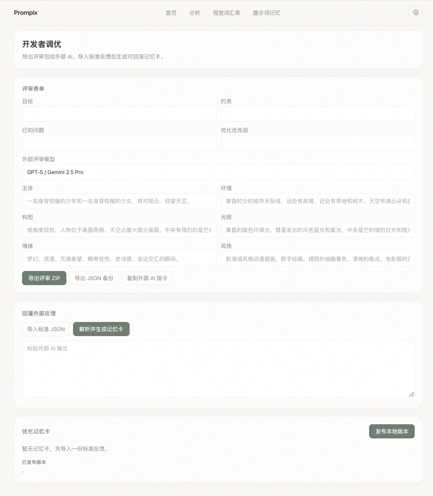
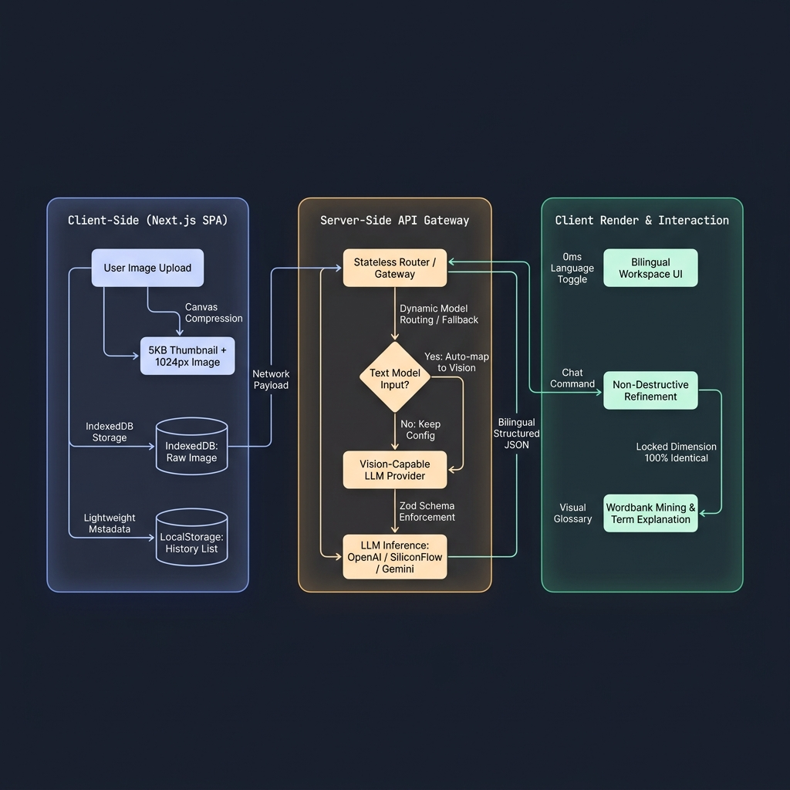

# 🎨 Prompix - Visual Prompt Intelligence Workspace
### A Poetic & Ambient Multi-Modal AI Visual Prompt Engineering & Refinement Studio

[中文版本](./README.md)

</div>

---

## 📷 Product Screenshots

#### 🏠 Home — Deconstruct Vision, Preserve Language
> A poetic, minimal landing page. Drag & drop to begin visual deconstruction.


#### 🔍 Analysis Workspace (English Prompts) — 6-Dimension Structured Breakdown + Weight Sliders
> AI decomposes visual language into Subject, Environment, Composition, Lighting, Mood & Style cards with adjustable prompt weights.


#### 🔍 Analysis Workspace (Chinese Prompts) — 0ms Bilingual Toggle
> Both languages are generated in a single inference call. Toggle instantly without re-querying the model.


#### 📖 Visual Lexicon — Term Mining & Deep Follow-up
> Auto-extracts professional visual terms from analysis results, with definitions, usage guides, and multi-turn follow-up Q&A.


#### 📦 Prompt Memory — Creative Asset Management & Batch Export
> All analysis history displayed as a thumbnail gallery. Supports batch selection, JSON import/export, and keyword search.


#### 🧪 Developer Lab — External AI Review & Memory Card Rollback
> Package analysis into structured review bundles for external AI (GPT-5 / Gemini), then import feedback as rollback-ready optimization memory cards.


---

## 💡 Product Positioning & Pain Point Analysis

In the era of AI visual creation driven by Midjourney, Stable Diffusion, and DALL-E, the core pain point for creators is no longer "how to generate an image," but rather "how to precisely control and curate their visual language system."

Traditional prompt-reversing tools (like CLIP or simple LLM Q&A) present three critical limitations:
1. **Ephemeral Tools, No Asset Retention**: Simple "upload -> text generation" flows fail to save history, making it impossible for creators to preserve inspirations as structured creative assets.
2. **High Inference Cost & Latency**: Swapping between languages (e.g., Chinese/English) requires re-triggering expensive multi-modal API calls, causing friction and delay.
3. **Destructive Overwriting on Refinement**: When a user only wants to tweak "lighting", traditional LLMs often regenerate the entire prompt, destroying the composition, subject, and style.

**Prompix** is designed as a **private, structured, and local-first "Visual Prompt Intelligence Workspace" for AI creators**. It introduces "non-destructive dimension locking," "bilingual dual-output," and "split local storage" to address these exact limitations.

---

## 🗺️ System Architecture

Prompix adopts a **stateless server-side gateway + client-side high-capacity storage separation** architecture to guarantee user privacy and millisecond-level responsiveness:



> Architecture source file (Mermaid format): [docs/architecture-diagram.mmd](./docs/architecture-diagram.mmd)

---

## ✨ Core Highlights & Product Rationale

Throughout the development of Prompix, we align with the product philosophy of **"experience-driven, cost-sensitive, and engineering-disciplined."** Here is the reasoning behind our core product decisions:

### 🤖 1. Intelligent Model Fallback Engine
*   **Implementation**: If a user configures a text-only model (e.g., `deepseek-ai/DeepSeek-V3`, `gpt-3.5-turbo`, `o1-mini`) for an image analysis task, the routing layer automatically redirects the request to a vision-capable sibling on the fly, while preserving the text-only model for follow-up text operations.
*   **💡 PM Rationale**:
    *   **Why not block the user with an API error?** Users are not technical experts. Explaining `No endpoints support image input` drives bounce rates. Product designs should exhibit **Progressive Resilience**—handling fallback behind the scenes to keep error rates at zero.

### 0️⃣ 2. 0ms Bilingual Switch (Scheme A - Dual Language Output)
*   **Implementation**: During the first multi-modal analysis, the model is prompted via a structured Zod schema to output both English (`original`) and Chinese (`translated`) fields simultaneously.
*   **💡 PM Rationale**:
    *   **Why not translate on-demand via a translation API?**
        1.  **Repeated Token Costs**: On-demand translation creates recurring costs on every toggle.
        2.  **Network Delay**: A 2-3s delay breaks the user's flow.
        3.  **Model Hallucination**: Secondary calls risk formatting errors. A **single bilingual output enables 0ms toggle latency** while **reducing multi-modal inference costs by over 90%**.

### 🔒 3. Non-Destructive Dimension Card Locking
*   **Implementation**: Prompix breaks visual prompts into 6 dimensions (Subject, Environment, Composition, Lighting, Mood, Style). In chat-refinement mode, cards that are not mentioned in the query remain **100% character-identical**.
*   **💡 PM Rationale**:
    *   Generic chat interfaces rewrite the entire prompt. For artists, an accidental rewrite destroys compositions locked by random seeds. Card-level locking balances AI randomness with human control.

### 📦 4. Decoupled Dual-Layer Storage
*   **Implementation**: LocalStorage (5MB cap) is used exclusively for lightweight text metadata indexes. Large Base64 image files are stored asynchronously in IndexedDB. Canvas downsampling compresses images into ~5KB thumbnails on upload for instant library rendering.
*   **💡 PM Rationale**:
    *   Base64 files average 1-2MB. Storing them in LocalStorage crashes the browser in 3 uploads. Deserializing megabytes of images on library rendering lags the UI. Splitting database layers is critical to keeping the application smooth and local-first.

### 🚀 5. Multi-Provider Stateless Gateway (SSE Streams)
*   **Implementation**: Stateless routing supporting OpenAI, Claude, Gemini, SiliconFlow, and MiniMax via Server-Sent Events (SSE) with time-to-first-token (TTFT) under a few hundred milliseconds.
*   **💡 PM Rationale**:
    *   **Developer Mode vs. Managed Mode**: Tech-savvy creators want to use their own SiliconFlow or OpenAI keys. Beginners want to start immediately without knowing what an API key is. Supporting both models captures both advanced power-users and mainstream audiences.

### 🔍 6. Wordbank Glossary Mining
*   **Implementation**: Auto-extracts advanced visual terms (e.g., "Cinematic Lighting", "Volumetric Dust") into a persistent glossary. Creators can query definitions and applications locally.
*   **💡 PM Rationale**:
    *   Prompix goes beyond prompt reversal—it acts as an educational tool. Mined term definitions build a personalized visual dictionary, enhancing user retention.
 
### 🌾 7. Poetic Morandi Theme & Smooth Physics
*   **Design Details**: Warm Morandi oatmeal (`#FBF9F6`) and Obsidian black dual-theme. The UI overlays a subtle CSS SVG grain texture reminiscent of fibrous paper and utilizes custom Framer Motion physics (`stiffness: 100, damping: 20`) to eliminate cold, generic tool designs.
*   **💡 PM Rationale**:
    *   **Why not use high-saturation "tech gradients"?** Creators require deep focus; high-saturation layouts cause fatigue. Morandi tones and paper grain mimic physical art journals, providing a calming and tactile workflow.
    *   **Single Viewport Decision**: Strict adherence to a `100vh` zero-scroll grid. Keeping all panels on one screen prevents vertical scrolling from interrupting the "refine-copy-compare" loop.

### 🧠 8. Dual-Model Cost-Reduction Routing
*   **Implementation**: Introduces a split routing mechanism using a "multi-modal vision model + lightweight text-only sibling model." Visual-heavy tasks like raw image analysis and image-based follow-ups are routed to the vision-capable model, while text-only operations (such as translations, glossary term explanations, and text-only follow-ups) are routed on the fly to a lightweight model, maintaining interaction speed while cutting costs.
*   **💡 PM Rationale**:
    *   Vision-capable models charge a premium for input tokens. Directing trivial text-only glossary lookup or simple follow-up prompts to these models bloats API usage billing.
    *   Through this routing logic, we **slash API execution costs by over 60%**, preserving high-quality user experiences at a fraction of the cost.

### 🔒 9. Visual Wordbank Context Isolation
*   **Implementation**: Implements strict context isolation where the visual wordbank is scoped to the active workspace image. When a user uploads a new image or activates a different historical record, the glossary view automatically purges old metadata and mines only **the vocabulary relevant to the active canvas**, preventing bleed-over.
*   **💡 PM Rationale**:
    *   Global glossary lists accumulate terms across unrelated styles, confusing creators on which terms belong to the current generation context.
    *   **Absolute context isolation** significantly reduces cognitive load and visual clutter, allowing creators to focus entirely on refining the active artwork's semantic structure.

---

## 🛠️ Tech Stack & Directory Structure

*   **Core**: Next.js 15.3 (App Router) + React 19.1
*   **State**: Context API + `useReducer` (prevents rendering conflicts from async delays)
*   **Motion**: Framer Motion 11
*   **Database**: IndexedDB (`idb-keyval` wrapper)

### 📂 Directory Structure
```bash
├── scripts/                   # CLI build & launch scripts
│   ├── launch-prompix.mjs     # Dev launcher: checks ports and opens browser
│   └── stop-prompix.mjs       # Graceful exit & process cleanup script
├── next-web/                  # Next.js 15 Project
│   ├── app/                   # App Router pages & API Gateway
│   ├── components/            # UI components (Morandi style & Framer Motion)
│   ├── lib/
│   │   ├── server/            # Provider routing, rate limiter, output parser
│   │   ├── services/          # Client-side API providers & fallback mapping
│   │   ├── state/             # AppState Context
│   │   ├── data/              # IndexedDB storage adapter
│   │   └── i18n/              # 7-language localization hooks
│   └── tests/                 # Testing suites
│       ├── unit/              # 76 unit tests (including prefetch queue, context isolation, adaptive category correction, bypass caching, fallback routing, etc. across 22 test files)
│       └── e2e/               # 6 Playwright browser tests
└── miniapp/                   # WeChat Mini Program experimental port
```

---

## 🚦 Testing & Engineering Quality

We implement a two-layer test suite to ensure release stability:

### 🧪 1. 76 Vitest Unit Tests (22 Test Files)
Covers key computational steps, routing, fallbacks, cache policies, prefetch queues, context isolation, and adaptive category corrections:
*   **Storage**: Verifies decoupled LocalStorage indexing and IndexedDB writes.
*   **Output Normalization**: Validates parsing of corrupted model JSON.
*   **Category Correction & Isolation**: Ensures aspect ratio/resolution terms auto-correct and visual wordbank isolates correctly.
*   **Prefetch & Bypass Cache**: Validates prefetching queue prioritization, max-15 length caps, and 0 Token static explanation bypass.

### 🎭 2. 6 Playwright E2E Tests
Runs automated browser actions:
*   `smoke.spec.ts`: Confirms loading, page transitions, and viewport constraints.
*   `analysis-autofill.spec.ts`: Mocks image drag-and-drop and cards auto-filling.
*   `settings-clear-cache.spec.ts`: Confirms DB purge on settings reset.

---

## 🗺️ Roadmap & Milestones

*   [x] **v0.8.0 - Core Loop**: SSE streaming, multi-modal parser, Canvas compression.
*   [x] **v0.9.0 - Storage Layer**: Key security isolation, IndexedDB split storage.
*   [x] **v1.0.0 - Release**: 7-language i18n, MIT License.
*   [x] **v1.1.0 - Formats Panel**: Midjourney/SD/DALL-E copy panels with frosted glass design.
*   [x] **v1.2.0 - Cleanups & Fallbacks**: Removed fonts block timeout, optimized wordbank extraction, implemented **Intelligent Fallback Engine**.
*   [x] **v1.3.0 - Dual-Model Routing & Context Isolation**:
    - Implemented dual-model architecture (vision + lightweight text model) for text-only routing, reducing API bills by 60%+.
    - Strict workspace isolation: auto-clears and re-mines wordbank when switching images.
    - Local static preset bypass (0 Token explanation), sequential prioritization, and a max-15 prefetch ceiling.
    - Hallucination guardrails, schema required constraints, and aspect ratio/resolution classification correction rules.
*   [x] **v1.4.0 - Aspect Ratio & Text Denoising**:
    - **Dynamic Aspect Ratio**: Detects the original image ratio (e.g. `16:9`, `9:16`, `1:1`) during compression and propagates it directly into Midjourney parameter configs (`--ar 16:9`).
    - **Visual Text Denoising**: Filters preposition phrases, pure numbers, and generic stopwords via `isPureVisualTerm` to preserve professional visual prompt terms.
*   [x] **v1.5.0 - Collapsed Sliders, Adaptive Compiling & Local Glossary**:
    - **Focused Sliders**: Replaces bulky "Save/Apply/Close" buttons with smooth Framer Motion sliders that toggle when cards are focused or clicked.
    - **Adaptive Prompt Compiling**: Decouples compiling into `promptCompiler.ts`, omitting default `1.0` weights and formatting custom weights precisely for Midjourney (`::1.5`) and Stable Diffusion (`(word:1.5)`).
    - **0-Token Static Glossary**: Intercepts term explain queries using a local database (`presets-glossary.json`) to skip unnecessary LLM token calls and latency.
    - **Slider Vertical Alignment (v1.5.1)**: Fixes Range Slider track and thumb alignments in Safari / Webkit browsers to align perfectly with subtle hover micro-interactions.
*   [ ] **v1.6.0 - Future: Semantic Search**: Local int8 CLIP model (ONNX) for text-to-image and image-to-image search in-browser.

---

## ⚙️ Quick Start

### 1. Install Dependencies
Run in the root directory:
```bash
npm install
```

### 2. Configure Environment
Create `next-web/.env.local` (Local mode has built-in mock demo data, so keys are optional; fill in your API key to access live endpoints):
```bash
NEXT_PUBLIC_RUNTIME_POLICY=local

# Managed Gemini API (Platform connection, or fill in via Settings UI)
GEMINI_API_KEY=your_key_here
GEMINI_MODEL=gemini-2.5-flash
``` 


### 3. Launch Dev Server
```bash
npm run start
```
*   Opens the browser automatically at [http://localhost:4300](http://localhost:4300).
*   On Mac, you can also double-click `Open-Prompix.command`.

---

## 📄 License

MIT License. All visual algorithms are protected under local-first user privacy guidelines.
